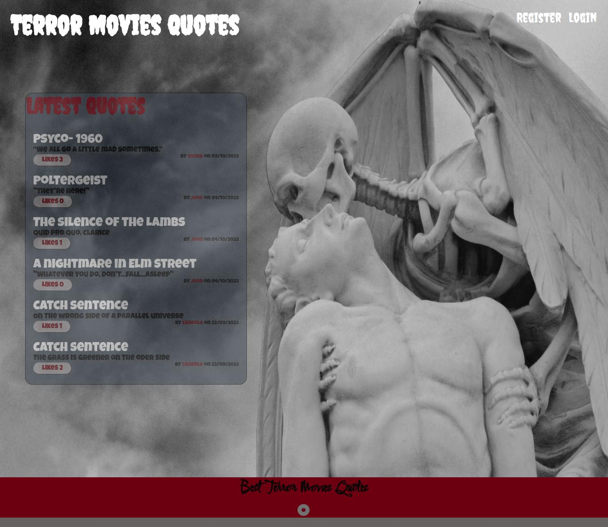

# Dynamic portal to post Terror movies quotes.

There are 2 level of users, depending on how much the client wants to interact with the platform.

**With no registration the client will be available to :**
 See the latest posts, their creater and how many votes they have  but  no interaction  will be possible at all. In addition could link in the title to see independently the post and its details.
Clicking on the creator will be possible as well to see their details.

**If the user subsequently decides to  register and login:**
Will  have access to see all the posts organized by client and movie and  could wander around  as well as edit their details of name and password; the email  will be unique and will remain  the same as long as the user wants to keep on being part of the terrorMoviesQuotes family.
Login clients in addition will have access to create as many quotes as they desire, vote others people quotes and delete their own  posts if they wish.

**This repo was made using:**
- html
- css
- js
- react
- mysql
- node

**And  the following libraries:**
- npm
- express
- mysql2
- mysql2-promise
- nodemon
- bcrypt
- chance
- cors
- dotenv
- jsonwebtoken
- morgan
- promise

*In addition EsLint & Prettier were of a great help :)*